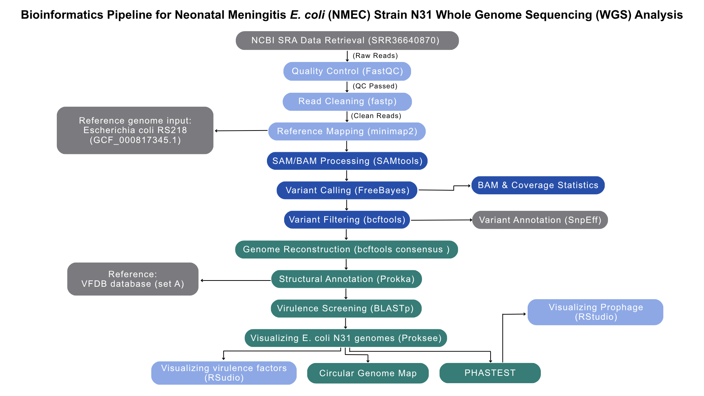
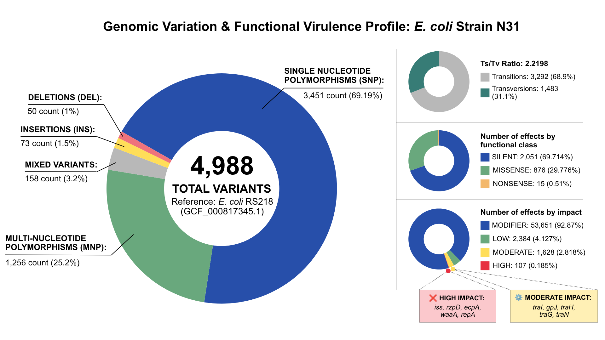
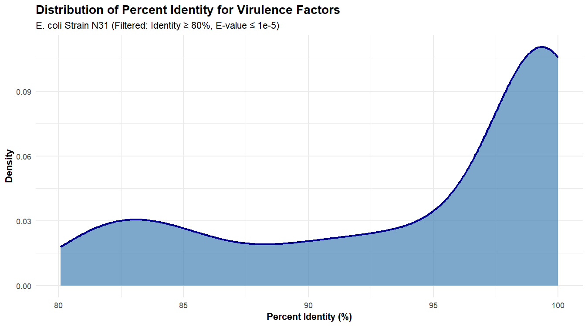
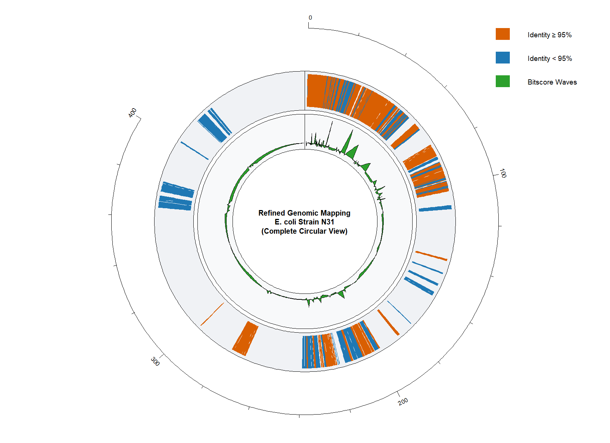
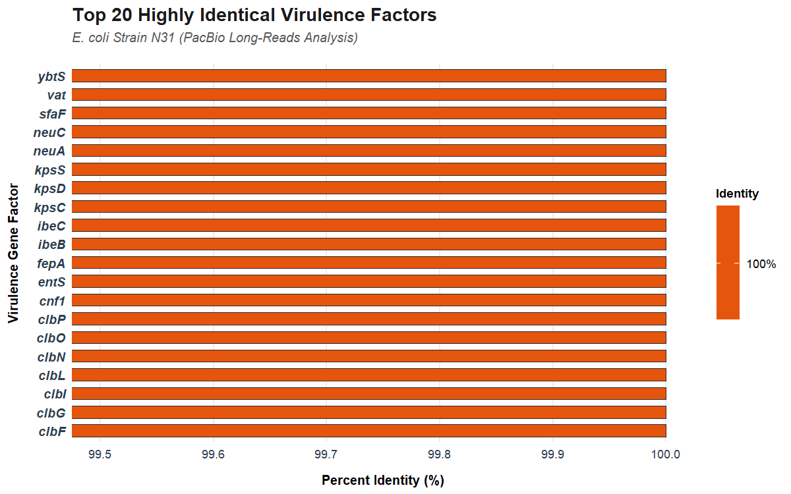
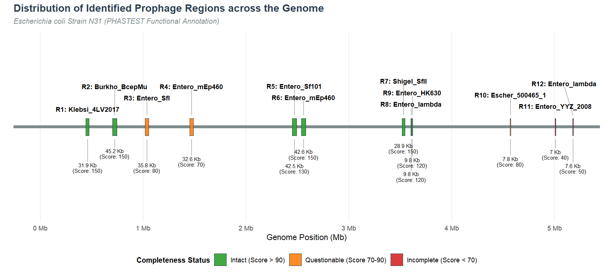
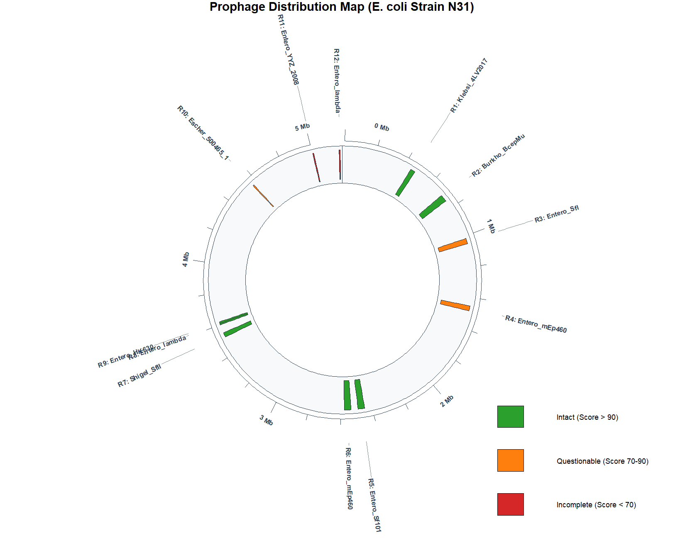
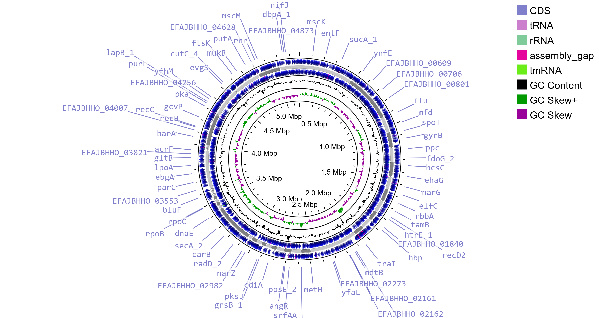

# Neonatal Meningitis *E. coli* (NMEC) Strain N31: Whole-Genome Sequencing & Comparative Pathogenicity Pipeline

<p align="left">
  
  
  
  
</p>


## ✨ Project Highlights

✔ Public NCBI SRA dataset analysis (Strain N31 from infant CSF)

✔ End-to-end WGS comparative workflow (vs Gold Standard RS218)

✔ 96.45% Genome mapping coverage

✔ Mean coverage depth 55.12×

✔ 4,988 Genomic variants (SNPs & Indels) identified via FreeBayes

✔ 12 Integrated prophage regions mapped via PHASTEST (7 classified as fully Intact)

✔ Pathogenicity Islands clustered at 0.0–0.5, 2.0–2.5, and 3.0–3.5 Mb

---

## 📌 Project Overview
*E. coli* Strain N31 is a clinical NMEC isolate recovered from the cerebrospinal fluid of an infected neonate in Georgia. This project applies an integrated bioinformatics pipeline to characterize its genome — identifying virulence-associated variants, mobile genetic elements, and prophage integrations relative to the RS218 reference.

---
## 🎯 Key Objectives
- Identify functional variants and virulence-associated mutations
- Visualize genome structure and annotated features as a circular map
- Map horizontally acquired mobile genetic elements and prophage integration sites

---

## 📊 Dataset
- **Organism:** _Escherichia coli_
- **Run Accession Number:** SRR36640870
- **Platform:** PacBio Sequel II (Pacific Biosciences)
- **Reference:** *Escherichia coli* RS218 (GenBank: GCF_000817345.1)

---

## ⚙️ Pipeline Overview
The workflow is structured into 5 modular phases, each implemented as a shell script:



---

## 🛠️ Software & Versions

> Built and tested on **WSL Ubuntu** (Linux terminal container).

| Tool | Version |
| :--- | :--- | 
| **Conda** | 26.1.1|
|**SRA Toolkit** |3.0.3 |
| **FastQC** | 0.12.1 | 
| **fastp** | 1.3.0 | 
| **minimap2** | 2.31-r1302 | 
| **SAMtools**| 1.23.1 | 
| **FreeBayes**| 1.3.10 | 
| **bcftools** | 1.19 | 
| **snpEff** | 4.3t | 
| **Prokka** | 1.13 | 
| **BLASTp+** | 2.17.0+ | 
| **RStudio** | 2026.1.0.392 | 

---

## 📂 Repository Structure

```
E.coli-WGS-Bioinformatics-Pipeline
│
├── scripts/
│   ├── mission01_data_preparation.sh
│   ├── mission02_genome_mapping.sh
│   ├── mission03_convert_sort.sh
│   ├── mission04_variant_calling.sh
│   ├── mission05_virulence_profiling.sh
│   ├── virulence_factors_plot.R
│   ├── phastest_visualization.R
│   └── README.md
│
└── results/
│   ├── variants/
│   │   ├── snpEff_summary.genes.txt
│   │   ├── variants_annotated.vcf
│   │   ├── variants_filtered.vcf
│   │   ├── variants_norm.vcf
│   │   └── variants_raw.vcf
│   ├── annotation/
│   │   └── ....
│   ├── virulence/
│   │   └── virulence_blast_results.tsv
│   ├── phastest/
│   │   ├── detail.txt              
│   │   ├── region_DNA.txt   
│   │   └── summary.txt
│   ├── Bioinformatics_pipeline.png
│   ├── Variant_analysis.png
│   ├── Virulence_density_plot.png 
│   ├── Virulence_spatial_distribution.png
│   ├── Top20_virulence_factors.png 
│   ├── Circular_map_strainN31_proksee.png
│   ├── Circular_prophage_map.png
│   └── Linear_prophage_map.png
│     
├── .gitignore 
├── LICENSE  
└── README.md
```

---

## 📈 Analysis Results & Metrics

### Quality Control & Data Preprocessing (fastp)

| Metric | Pre-Trimming | Post-Trimming | Status |
| :--- | :---: | :---: | :---: |
| **Total Reads** | 33,575 | 33,542 | Passed |
| **Total Bases** | 303,979,223 | 303,961,566 | Passed |
| **Q30 Quality (%)** | 96.66% | 96.66% | % Reads passed filters > 80% |
| **GC Content (%)** | 50.8% | 50.8% | Balanced |

Raw data quality was already exceptional (Q30: 96.66%). `fastp` was run primarily to filter reads under 1 Kb (`--length_required 1000`), removing fragmented reads that could introduce chimeric artifacts during alignment. Only 33 of 33,575 reads were discarded, retaining 99.91% of the data.

---

### Reference Alignment (SAMtools)

| Metric | Value |
| :--- | :---: |
| Mapped Reads (%) | 98.12% |
| Total Mapped Reads | 38,361 |
| Mean Coverage Depth | ~55x |

98.12% read mapping against *E. coli* RS218 confirms strong genomic alignment with the NMEC lineage. Mean coverage of ~55x provides high-confidence depth for variant calling.

---

### Variant Calling & Functional Annotation



`snpEff` identified HIGH-impact mutations in serum survival (`iss`) and pilus assembly (`ecpA`) genes, alongside a dense cluster of missense variants across the `tra/trb` conjugative machinery — suggesting N31 has diverged from classical ExPEC/NMEC virulence strategies and may rely on alternative pathogenic mechanisms.

---

### Virulence Profiling & Functional Validation



The identity distribution is strongly right-skewed, with a dominant peak at 95–100% — confirming that the vast majority of N31's virulence arsenal remains evolutionarily conserved despite localized mutations.



Virulence factors cluster into discrete dense regions across the chromosome, consistent with Pathogenicity Islands (PAIs) acquired via horizontal gene transfer.



BLASTp screening against VFDB confirmed that the top 20 virulence factors all retain **100% amino acid identity**, including the blood-brain barrier (BBB) invasion machinery (`ibeB`, `ibeC`), S-fimbriae anchor (`sfaF`), and K1 capsule biosynthesis cluster (`neuA`, `neuC`, `kpsC/D/S`). N31's neurotropic capacity is fully intact.

---

### Mobilome Characterization & Prophage Mapping

| Region | Position (Mb) | Length (Kb) | Status | Score | Top Phage Hit |
|:---:|:---:|:---:|:---|:---:|:---|
| R1 | 0.44–0.48 | 31.9 | Intact | 150 | Klebsi_4LV2017 |
| R2 | 0.70–0.75 | 45.2 | Intact | 150 | Burkho_BcepMu |
| R3 | 1.01–1.05 | 35.8 | Questionable | 80 | Entero_SfI |
| R4 | 1.45–1.49 | 32.6 | Questionable | 70 | Entero_mEp460 |
| R5 | 2.45–2.49 | 42.5 | Intact | 130 | Entero_Sf101 |
| R6 | 2.54–2.58 | 42.6 | Intact | 150 | Entero_mEp460 |
| R7 | 3.52–3.54 | 28.9 | Intact | 150 | Shigel_SfII |
| R8 | 3.60–3.61 | 9.8 | Intact | 120 | Entero_lambda |
| R9 | 3.61–3.62 | 9.8 | Intact | 120 | Entero_HK630 |
| R10 | 4.56–4.57 | 7.8 | Questionable | 80 | Escher_500465_1 |
| R11 | 5.00–5.01 | 7.0 | Incomplete | 40 | Entero_YYZ_2008 |
| R12 | 5.17–5.18 | 7.6 | Incomplete | 50 | Entero_lambda |





PHASTEST identified **12 prophage regions** (7 intact, 3 questionable, 2 incomplete) spanning ~270 Kb of the genome. A notable integration hotspot is visible between 2.4–3.6 Mb, with high homology to pathogenic *Shigella* phages. Combined with a HIGH-impact mutation in the lytic gene `rzpD`, this pattern is consistent with **phage domestication** — where intact prophages are chromosomally trapped to permanently contribute virulence and fitness genes.

---

### Whole-Genome Macro-Architecture



The ProKSee circular map reveals a well-organized ~5.18 Mb chromosome with dense CDS coverage and a symmetrical GC skew pattern, indicating structurally clean *oriC* and *Ter* sites. Despite integrating 12 prophages and accumulating localized mutations, the overall genome architecture remains highly stable.

---

## ⚠️ Methodological Note: Reference-Based Consensus Assembly

Genomic analysis was performed using `bcftools consensus` mapped against *E. coli* RS218.
- **Limitation:** This pipeline reliably detects SNVs and indels but cannot identify novel accessory genes or mobile genetic elements (MGEs) absent from the RS218 reference.

- **Virulence screening:** The 100% identity in the Top 20 Virulence Factors plot confirms that Strain N31's core neurotropic machinery — including the `ibeBC` invasion system and `kps/neu` capsule clusters — remains fully intact despite mutations flagged by `snpEff`.

- **Future work:** Full accessory genome characterization requires *de novo* assembly via [Flye](https://github.com/mikolmogorov/Flye) or [Unicycler](https://github.com/rrwick/Unicycler).


---

# Author

**Inggrid Widia Pramono, S.Si.**

**LinkedIn:** www.linkedin.com/in/inggridwidia

**Email:** inggridwidia323@gmail.com

**Research Interests:** 

Molecular Biology, Biomedical Science, Microbiology, Infectious Disease Research, & Genomic Data Science

